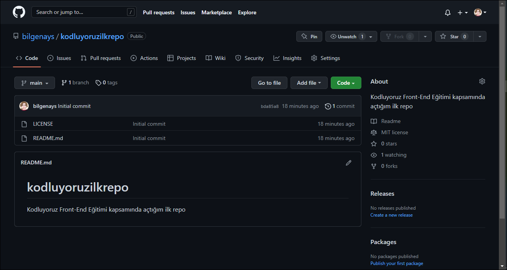

# Patika İlk Repository
## Bu repo [Patika.dev](https://app.patika.dev/courses/git/odev1) Front-End eğitimi kapsamında ödevi tamamlamak için açtığım bir repodur.

### Repo Ekran Görüntüsü:

# Installation
## Projemi terminale yazdığım şu kod ile clone'ladım:
`git clone https://github.com/bilgenays/Patika-llk-Repo.git`

# Usage
## Projeyi clone'ladıktan sonra Visual Studio Code'da açtım.
`Open VSC > Explorer > Open Folder > Choose "Patika-İlk-Repo-main" folder`

# Contributing
## Umarım bu konuda kendimi geliştirebilirim.

# License
[MIT](https://choosealicense.com/licenses/mit/)

